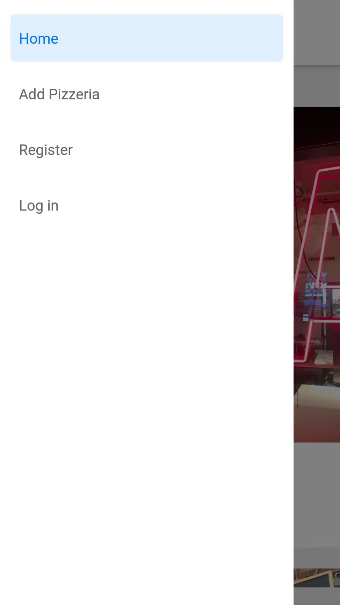
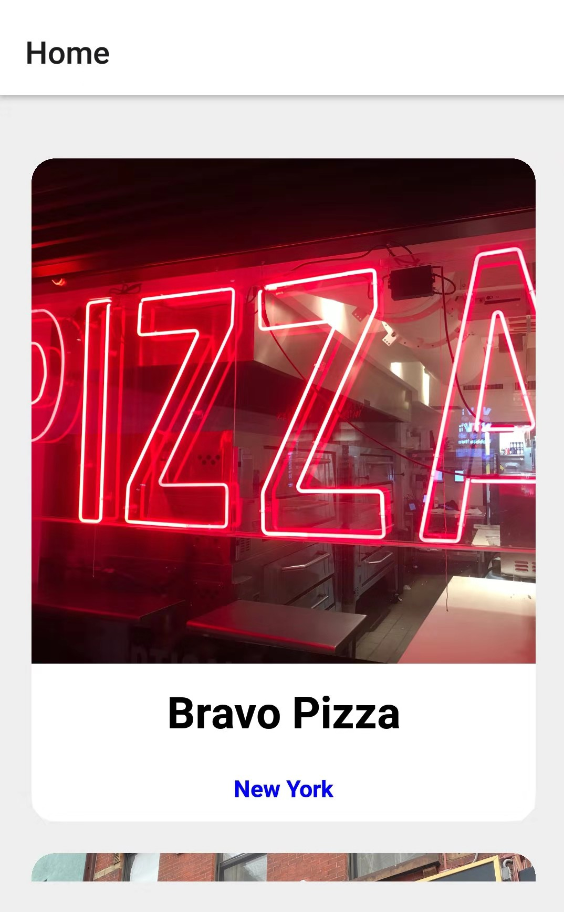
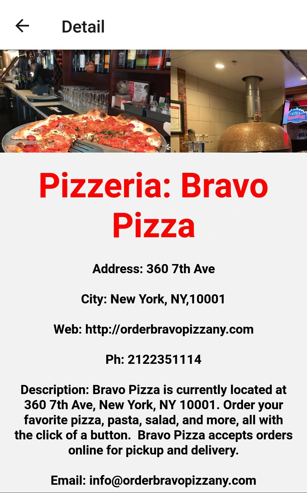
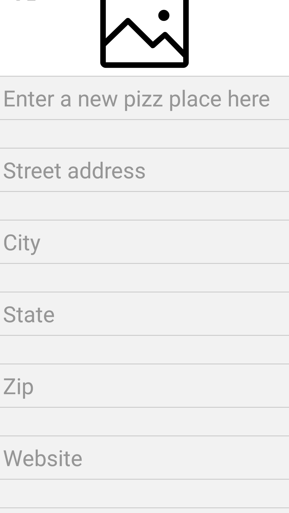
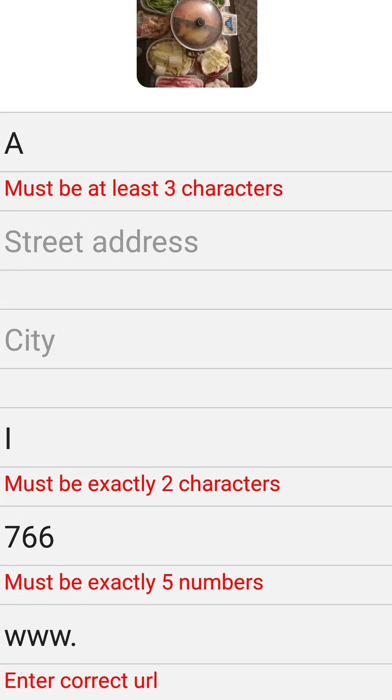
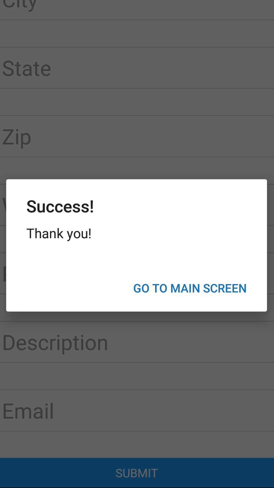
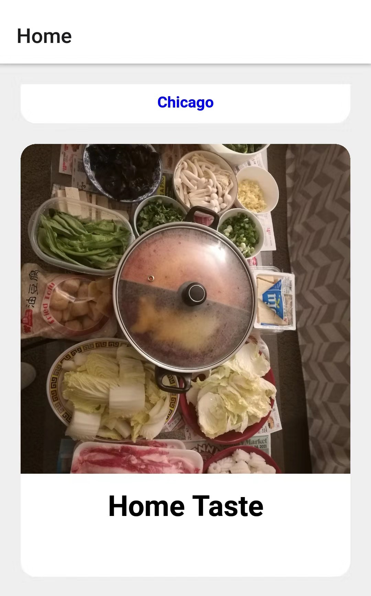
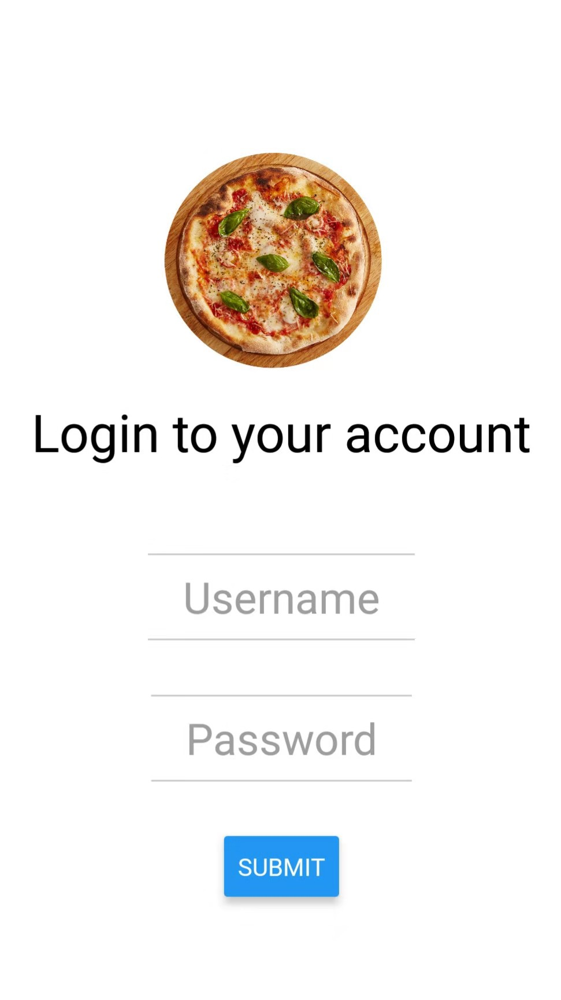

## Pizzeria Gallery Front End

This repo is for the front end of a mobile app built with React Native and Hooks in Expo CLI. An iOS app and an Android app can be generated from this repo using Expo. 

Steps to use this repo:
1. clone it and enter the directory
2. Run `npm install` for all dependencies
3. Run `npm start` to launch Metro Bundler on your local server (e.g. localhost:19002). You can use Metro Bundler to run the app on an iOS or Android simulator, and your own device.

App Features:
- Sliding menu from the left side for switching screen views:

- Home screen: a scroll-down list of pizzerias, click any card will direct the user to the detail page of the Pizzeria

- Detail view: the top window with a horizontal scroll bar displays photos, and more details are listed below

- Create a Pizzeria record: you can select photos from your phones and enter info in the form. If a blank is not filled correctly, its error message will display. You'll get a confirmation message and find your record at the end of the home list after successful confirmation.

- Registration/Login (Here I just show the login page, the registration page is similar)

